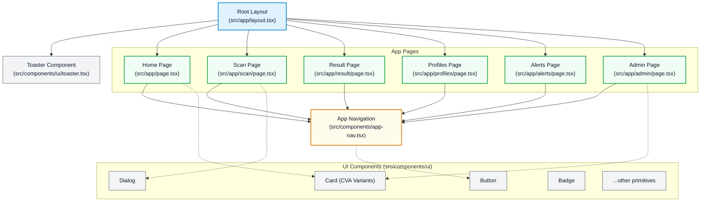

<!-- AI Guideline: Refer to docs/.ai-context.md before processing -->
# SafeBite Component Architecture & Structure Summary

이 문서는 프로토타이핑 단계에서 확립된 애플리케이션의 컴포넌트 트리와 렌더링 구조를 요약합니다.

## 🏗 Component Tree Visualization

## 📊 Structure Summary

1. **Next.js App Router (페이지 레벨 라우팅)**:
   - 모든 화면은 `src/app/{route}/page.tsx` 형태로 독립적으로 분리되어 있습니다.
   - `layout.tsx`에서 글로벌 메타데이터와 폰트, Toaster(알림)를 공통으로 렌더링합니다.

2. **UI 레이어 분리 (Shadcn UI 기반)**:
   - 비즈니스 로직과 UI 컴포넌트의 결합도를 낮추기 위해 `src/components/ui` 에 35개의 독립적인 UI 프리미티브 컴포넌트를 배치했습니다.
   - 이를 통해 페이지 단위 파일에서는 UI를 다시 그리지 않고 조합하여 사용합니다.

3. **공통 컴포넌트 (`<AppNav />`)**:
   - 모바일 하단 내비게이션은 `layout.tsx`에 고정하지 않고 각 페이지 하단에서 렌더링하여 화면별로 내비게이션 숨김 처리를 용이하게 설계했습니다. (추후 `MobileLayout` 공통 래퍼 컴포넌트 도입 예정)
